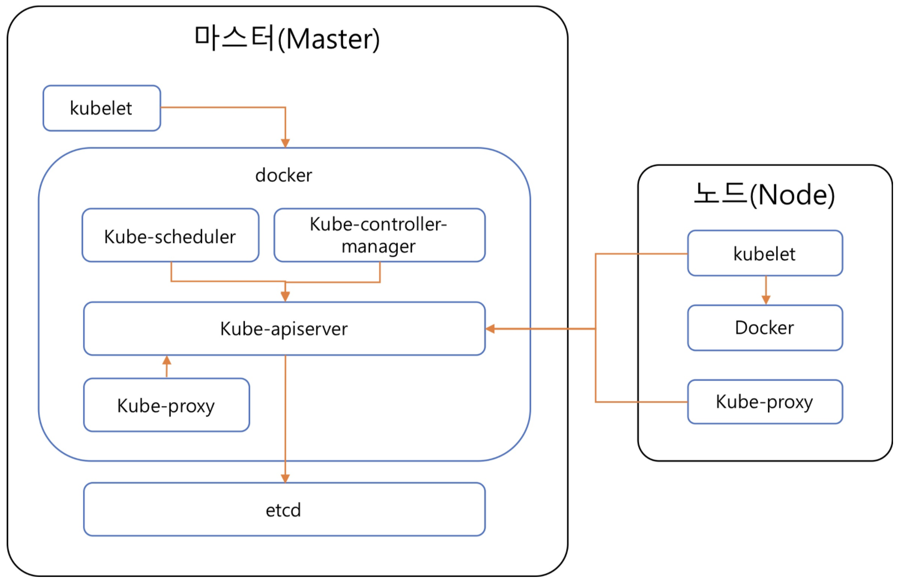

# 04장 쿠버네티스 기본 개념

<ABG/>

<br/>

## 쿠버네티스 클러스터의 전체 구조



### 마스터(Master)

#### 마스터 노드란

- 노드들의 상태를 관리하고 제어. 쿠버네티스와 데이터 저장소로 사용하는 etcd를 함께 설치하거나 별도 노드에 분리해서 설치
- 상용 서비스라면 보통 고가용성을 고려해 3대나 5대로 구성
- Kube-controller-manager가 활성화상태로 동작할 수 있는 리더 마스터 노드는 1대이고, 마스터 노드가 많다고 성능이 크게 향상되지는 않으므로 3~5개가 적당

#### 마스터용 컴포넌트: 클러스터 전체 관리

- ##### kubelet
  - kubelet은 마스터에 있는 도커를 관리
  - 도커 안에는 쿠버네티스 관리용 컴포넌트가 있고, 이 관리용 컴포넌트 모두는 하이퍼 큐브라는 바이너리 파일로 컴파일되어있고, 실행할 때 옵션을 설정해 각 컴포넌트의 역할 수행

- ##### kube-apiserver

  - 쿠버네티스 클러스터의 API를 사용할 수 있도혹 하는 컴포넌트
  - 클러스터로 온 요청이 유효한지 검증
  - 쿠버네티스는 마이크로 서비스 아키텍처로 모든 통신은 kube-apiserver를 거쳐 다른 컴포넌트가 서로 필요한 정보를 주고 받음
  - etcd에는 kube-apiserver만 접근 가능

- ##### etcd

  - 코어OS에서 개발한 고가용성을 제공하는 키-값 저장소
  - 분산 시스템에서 노드 사이의 상태를 공유하는 합의 알고리즘 중 하나인 raft 알고리즘을 구현한 것
  - 쿠버네티스에서 필요한 모든 데이터를 저앟나는 데이터베이스 역할

- ##### kube-scheduler

  - 현재 클러스터 안에서 자원 할당이 가능한 노드 중 알맞은 노드를 선택해서 새롭게 만든 파드 실행

- ##### kube-controller-manager

  - 쿠버네티스는 파드들을 관리하는 컨트롤러가 존재하는데, 컨트롤러 각각은 논리적으로 개별 프로세스지만 복잡도를 줄이려고 모든 컨트롤러를 바이너리 파일 하나로 컴파일해 단일 프로세스로 실행
  - kube-controller-manager는 컨트롤러 각각을 실행하는 컴포넌트

- ##### cloud-controller-manager

  - 쿠버네티스의 컨트롤러들을 클라우드 서비스와 연결해 관리하는 컴포넌트

### 노드(Node)

#### 노드란

- 실제 컨테이너를 실행시키는 노드
- kubelet이라는 프로세스(에이전트)가 동작하며, 마스터 노드의 명령을 받아 사용자가 선언한 파드나 잡을 실제 실행

- kubelet으로 도커를 관리하고 kubelet은 마스터의 kube-apiserver와 통신하면서 파드의 생성, 관리, 삭제를 담당
- 노드의 kube-proxy는 마스터와 다르게 컨테이너가 아니라 서버 프로세스로 실행 가능

#### 노드용 컴포넌트: 실행 환경 관리

- ##### kubelet
  - 클러스터 안 모든 노드에서 실행되는 에이전트
  - 파드 컨테이너들의 실행을 직접 관리
  - PodSpecs라는 조건이 담긴 설정을 전달받아서 컨테이너를 실행하고 컨테이너가 정상적으로 실행되는지 헬스 체크를 진행
  - 쿠버네티스가 만들지 않은 컨테이너는 관리하지 않음

- ##### kube-proxy

  - 클러스터 안에 별도의 가상 네트워크를 설정하고 관리
  - 호스트의 네트워크 규칙을 관리하거나 연결 전달

- ##### 컨테이너 런타임

  - 실제로 컨테이너 실행
  - 가장 많이 알려진 런타임으로 도커가 있고, containerd, runc 같은 런타임도 지원

### 애드온

#### 애드온이란

- 클러스터 안에서 필요한 기능을 실행하는 파드
- 네임스페이스는 kube-system이며 애드온으로 사용하는 파드들은 디플로이먼트, 리플리케이션 컨트롤러 등으로 관리

#### 대표적인 애드온

- ##### 네트워킹 애드온

  - 클러스터 안에 가상 네트워크를 구성해 사용할 때 kube-proxy 이외에 네트워킹 애드온(네트워크 플러그인)을 사용
  - 쿠버네티스를 직접 서버에 구성한다면 네트워킹 관련 애드온을 설치해서 사용

- ##### DNS 애드온

  - 클러스터 안에서 동작하는 DNS 서버
  - 쿠버네티스 안에서 실행된 컨테이너들은 자동으로 DNS 서버에 등록

- ##### 대시보드 애드온

  - 웹 UI로 클러스터 현황이나 파드 상태를 한 눈에 쉽게 파악 가능

- ##### 컨테이너 자원 모니터링

  - 클러스터 안에서 실행 중인 컨테이너의 상태를 모니터링하는 애드온
  - CPU 및 메모리 사용량 같은 데이터들을 시계열 형식으로 저장해서 볼 수 있음
  - kubelet 안에 포함된 cAdvisor라는 컨테이너 모니터링 도구 사용

- ##### 클러스터 로깅

  - 클러스터 안 개별 컨테이너의 로그와 쿠버네티스 구성 요소의 로그들을 중앙화한 로그 수집 시스템에 모아서 보는 애드온
  - 로그를 수집해서 보여줄  때는 ELK(ElasticSearch, Logstash Kibana)나 EFK(Elastic Fluentd, Kibana)를 많이 사용

<br/>

## 오브젝트와 컨트롤러

- 쿠버네티스는 크게 오브젝트와 오브젝트를 관리하는 컨트롤러로 나뉨
- 사용자는 템플릿 등으로 쿠버네티스에 자원의 바라는 상태를 정의하고 컨트롤러는 바라는 상태와 현재 상태가 일치하도록 오브젝트들을 생성/삭제

### 오브젝트(Object) 

- 파드(Pod)
- 서비스(Service)
- 볼륨(Volume)
- 네임스페이스(Namespace)

### 컨트롤러(Controller)

- 레플리카세트(ReplicaSet)
- 디플로이먼트(Deployment)
- 스테이트풀세트(StatefulSet)
- 데몬세트(DaemonSet)
- 잡(Job)

### 오브젝트/네임스페이스

- 쿠버네티스 클러스터 하나를 여러 개 논리적인 단위로 나눠서 사용하는 것
- 네임스페이스를 이용해 클러스터 하나를 여러 개 팀이나 사용자가 함께 공유할 수 있음

```shell
$ kubectl get namespaces
NAME		       	 STATUS		AGE
default          Active   32m
docker 					 Active   30m
kube-node-lease  Active   32m
kube-public      Active   32m
kube-system      Active   32m
```

- **default:** 기본 네임스페이스
- **kube-system:** 쿠버네티스 시스템에서 관리하는 관리용 파드나 설정이 있는 네임스페이스
- **kube-public:** 클러스터 안 모든 사용자가 읽을 수 있는 네임스페이스
- **kube-node-lease:** 각 노드의 임대 오브젝트들을 관리하는 네임스페이스

#### 관련 명령어

- ##### 기본 네임스페이스 변경

  ```shell
  $ kubectl config set-context {context 명} --namespace={원하는 네임스페이스 명}
  ```

- ##### 전체 네임스페이스 조회

  ```shell
  $ kubectl get pods --all-namespaces
  ```

- 네임스페이스 변경을 돕는 kubens를 사용할 수도 있음

### 템플릿(Template)

- 쿠버네티스 클러스터의 오브젝트나 컨트롤러가 어떤 상태여야 하는지를 적용할 때는 YAML 형식의 템플릿 사용

#### YAML 형식

- ##### Scalars(strings/numbers)

  ```yaml
  Name: kim
  Birth: 2019
  ```

- ##### Sequences(arrays/lists)

  ```yaml
  ProgrammingSkills:
  	- java
  	- python
  	- c
  ```

- ##### Mappings(hashes/dictinaries)

  ```yaml
  Data:
  	Height: 170
  	Weight: 80
  ```

#### 각 필드 설명 확인 명령어

- pods 하위 필드 설명

  ```shell
  $ kubectl explain pods
  KIND:     Pod
  VERSION:  v1
  
  DESCRIPTION:
       Pod is a collection of containers that can run on a host. This resource is
       created by clients and scheduled onto hosts.
  
  FIELDS:
     apiVersion	<string>
       APIVersion defines the versioned schema of this representation of an
       object. Servers should convert recognized schemas to the latest internal
       value, and may reject unrecognized values. More info:
       https://git.k8s.io/community/contributors/devel/sig-architecture/api-conventions.md#resources
  
     kind	<string>
       Kind is a string value representing the REST resource this object
       represents. Servers may infer this from the endpoint the client submits
       requests to. Cannot be updated. In CamelCase. More info:
       https://git.k8s.io/community/contributors/devel/sig-architecture/api-conventions.md#types-kinds
  
     metadata	<Object>
       Standard object's metadata. More info:
       https://git.k8s.io/community/contributors/devel/sig-architecture/api-conventions.md#metadata
  
     spec	<Object>
       Specification of the desired behavior of the pod. More info:
       https://git.k8s.io/community/contributors/devel/sig-architecture/api-conventions.md#spec-and-status
  
     status	<Object>
       Most recently observed status of the pod. This data may not be up to date.
       Populated by the system. Read-only. More info:
       https://git.k8s.io/community/contributors/devel/sig-architecture/api-conventions.md#spec-and-status
       
  $ kubectl explain pods.metadata # 데이터 타입이 Object일 때만 가능
  ```

- 설명 없이 특정 필드와 그 아래에 속한 모든 하위 필드 조회

  ```shell
  $ kubectl explain pods --recursive
  ```

<br/>

## Referenses

- 쿠버네티스 입문 - 90가지 예제로 배우는 컨테이너 관리 자동화 표준 / 동양북스

