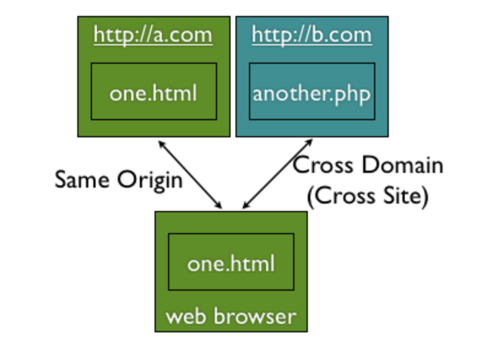

# CORS(Cross-Origin Resource Sharing)

<AssembledByGimunLee/>

## CORS란?

다른 도메인으로부터 리소스가 필요한 경우  **Cross-Site Http Request**가 필요합니다. 기존에는 **XMLHttpRequest**는 보안상의 이유로 동일 출처 정책(same-origin policy)으로 자신과 동일한 도메인으로만 HTTP 요청을 보내도록 제한하였습니다. 즉, Cross-Origin Http 요청을 제한하였습니다. 하지만, 지속적으로 웹 애플리케이션을 개선하고 쉽게 개발하기 위해서는 이러한 Request가 꼭 필요했습니다. 그래서 XMLHttpRequest가 Cross-Domain을 요청할 수 있는 방법이 필요하게 되었습니다. 이러한 요청을 바탕으로 CORS가 탄생하였습니다.

CORS는 Cross-Origin Resource Sharing의 약자로 **도메인** 또는 **포트**가 다른 서버의 자원을 요청하는 매커니즘을 말합니다. CORS 종류에는 아래와 같이 크게 4가지로 나누어 볼 수 있습니다.

- Simple Request

- Preflight Request

- Credential Request

- Non-Credential Request

**※ 동일 출처 정책(same-origin policy):** 불러온 문서나 스크립트가 다른 출처에서 가져온 리소스와 상호 작용하는 것을 제한하는 중요한 보안 방식입니다. 이것은 잠재적 악성 문서를 격리하여, 공격 경로를 줄이는데 도움이 됩니다. *(출처 - MDN web docs)*

 

## References

- [CORS에 대한 간단한 고찰](https://velog.io/@wlsdud2194/cors)
- [교차 출처 리소스 공유 (CORS)](https://developer.mozilla.org/ko/docs/Web/HTTP/CORS)

- [배워가는블로거](https://zamezzz.tistory.com/137)

